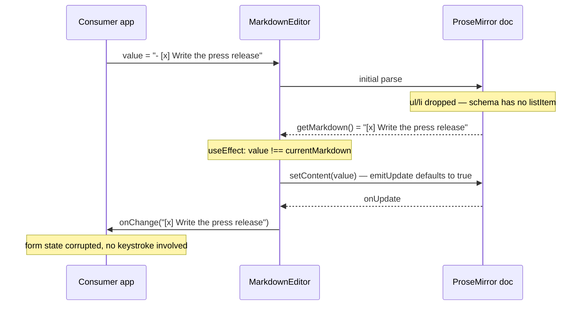
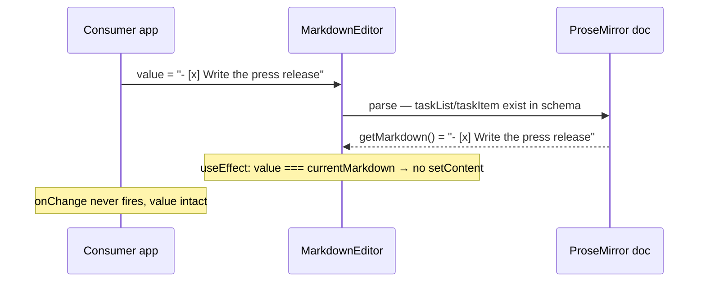

# Design: Markdown schema round-trip

**GitHub Issue:** — (to be created)
**Target release:** 0.10.0

## Summary

`MarkdownEditor` and `MarkdownView` are TipTap WYSIWYG editors, not one-way Markdown renderers. The ProseMirror document is the source of truth and the Markdown string is regenerated from it. Both components trim the StarterKit down to paragraphs, a few marks and links, so every Markdown construct outside that set has no node to live in and is silently discarded during parsing.

In `MarkdownEditor` this is not merely a rendering gap — it destroys stored data. Opening a form is enough to corrupt the value, without a single keystroke. This spec removes the trimming: the schema learns everything Markdown can express, so unsupported-but-stored content round-trips untouched. The toolbar stays exactly as it is; what the user may *create* is unchanged and is dealt with in spec `002-markdown-toolbar-actions`.

## Goals

- Markdown that goes into either component comes back out unchanged, for every construct Markdown can express and TipTap can model with the StarterKit plus task lists.
- Opening `MarkdownEditor` without editing never alters the value passed to `onChange`.
- `MarkdownView` renders those constructs instead of flattening them to text.
- The extension configuration lives in one place, shared by both components and by tests.
- Round-trip behaviour is covered by tests that exercise a real `Editor`, not a mock.

## Non-goals

- **No API change.** `MarkdownEditorProps` and `MarkdownViewProps` are untouched.
- **No new authoring capability.** The toolbar keeps its four actions. Task lists in particular remain impossible to create (see *Task list creation stays closed*).
- **No images, no tables.** Both are expressible in Markdown but are absent from the StarterKit and would need their own infrastructure (upload handling, table UI). Explicitly out of scope.
- **No underline.** StarterKit ships it, Markdown cannot express it. Enabling it would recreate exactly the data-loss bug this spec removes.
- **No interactive checkboxes.** Checkboxes render but do not respond to clicks; see spec `003-markdown-view-checkboxes`.
- **No i18n of toolbar labels.** Deferred to its own spec.

## Root cause analysis

Three facts combine into the bug.

1. **The schema is trimmed.** `markdown-editor.tsx:99-107` and `markdown-view.tsx:13-21` disable `heading`, `codeBlock`, `blockquote`, `horizontalRule`, `bulletList`, `orderedList` and `listItem`. `tiptap-markdown` parses the Markdown to HTML with markdown-it and hands it to ProseMirror; nodes absent from the schema are dropped and only their text content survives.

2. **`setContent` emits an update.** `SetContentOptions.emitUpdate` defaults to `true` in TipTap 3 (`@tiptap/core/dist/index.d.ts:3086-3090`).

3. **The sync guard compares against the already-damaged document.** `markdown-editor.tsx:129-132` compares the incoming `value` with `editor.storage.markdown.getMarkdown()`. On mount those differ — the prop still holds `- [x] foo`, the document holds `[x] foo` — so the effect calls `setContent`, which emits an update, which calls `onChange` with the stripped Markdown.



`MarkdownView` never writes back, so stored data is safe there — but it flattens the same constructs visually.

## Technical approach

### One shared extension factory

Both components build their own extension array today, duplicating the same `configure` block. That duplication is what let the two drift apart conceptually and it makes the round-trip untestable in isolation. The configuration moves to `src/lib/markdown-extensions.ts`:

```ts
export interface MarkdownExtensionsOptions {
  /** Placeholder text shown while the document is empty. Editor only. */
  readonly placeholder?: string;
  /** Whether clicking a link opens it. `true` in the view, `false` in the editor. */
  readonly openLinksOnClick?: boolean;
}

export function createMarkdownExtensions(options?: MarkdownExtensionsOptions): Extensions;
```

Both components call it, and the round-trip tests call it too — so what the tests verify is literally what ships. Specs 002 and 003 extend this options object rather than reopening the components.

**Rationale:** the alternative — exporting a plain array constant — cannot express the two genuine differences between editor and view (placeholder, link click behaviour). A factory keeps a single definition without forcing both call sites into the same configuration.

### The schema opens up

The `StarterKit.configure({ ... : false })` block is removed. `TaskList` and `TaskItem` are added from `@tiptap/extension-list`. The resulting schema covers headings H1–H6, bullet lists, ordered lists, task lists, blockquotes, code blocks, horizontal rules, hard breaks and the existing marks.

Two deliberate exceptions remain:

- `underline: false` — Markdown has no representation for it. Leaving it enabled would let a user apply a mark that is lost on the next save, which is the very failure mode being fixed.
- `link` is configured **through** the StarterKit instead of being registered separately. StarterKit 3.22 already ships `link` (`@tiptap/starter-kit/dist/index.d.ts`), so the current `Link.configure(...)` in both components registers the extension twice. With the extension list being rewritten anyway, the duplicate is removed and `@tiptap/extension-link` drops out of `dependencies`.

### Task list creation stays closed

Enabling `TaskList`/`TaskItem` opens three creation paths, and this spec must close all of them — otherwise, between 0.10.0 and 0.11.0, any user could create checklists anywhere, including in the tag descriptions where they are explicitly unwanted.

| Path | Source | Handling |
|------|--------|----------|
| Toolbar button | — | Not added in this spec |
| `Mod-Shift-9` | `TaskList.addKeyboardShortcuts` (`extension-list/dist/index.js:1090-1094`) | Stripped |
| Typing `[ ] ` | `TaskItem.addInputRules`, regex `/^\s*(\[([( \|x])?\])\s$/` (`index.js:963-972`) | Stripped |

```ts
const TaskListNode = TaskList.extend({ addKeyboardShortcuts: () => ({}) });
const TaskItemNode = TaskItem.extend({ addInputRules: () => [] });
```

`TaskItem`'s own keyboard shortcuts — `Enter` (split item), `Shift-Tab` (lift), `Tab` (sink, when `nested`) — are **kept** (`index.js:854-866`). They operate inside an existing task list rather than creating one; removing them would make loaded checklists impossible to edit sensibly.

`TaskItem` is configured with `nested: true`, because indented task lists are expressible in Markdown and the round-trip must survive them.

### Styling without new CSS

Task lists sit inside the consumer's `prose` container, which gives every `ul` a bullet and indentation — a checklist would render with a bullet *and* a checkbox. The fix travels as Tailwind utility classes on the nodes themselves:

```ts
TaskList.configure({ HTMLAttributes: { class: "list-none pl-0" } })
TaskItem.configure({ nested: true, HTMLAttributes: { class: "flex items-start gap-2" } })
```

**Rationale:** the alternatives both cost more. Adding rules to `src/styles/brand.css` puts component CSS into a 48-line token file that every consumer loads, even one that only uses `Button`. A separate stylesheet plus a new export path forces every app to add an import, and forgetting it fails silently. Utility classes match how the rest of the library already works (`cn`, `prose prose-sm`) and change nothing about packaging.

**Precondition:** the consuming apps must include the library sources in their Tailwind content configuration. They already must, for the existing `prose prose-sm` and component classes.

### Dependencies

`@tiptap/extension-list` is promoted from a transitive dependency to a declared one at `^3.22.0`, matching the other TipTap entries. `@tiptap/extension-link` is removed (see above). All TipTap packages come from the same release train and share `@tiptap/core`, so the ranges do not drift apart.

## Key flows

**Loading content that the old schema destroyed**



## Regression risk

- **Rendering changes for every existing usage.** Content that used to appear as flat text now appears as headings, lists, quotes and code blocks. This is accepted and is the point of the change; `docs/upgrade-to-0.10.md` documents it. Two consuming apps are affected and both are under our control.
- **`prose` styling of newly rendered blocks** is untested in the consuming apps. Headings inside a compact detail view may be visually oversized. Verified per app during the upgrade, not by this library.
- **Removing the duplicate `Link` registration** changes which extension instance provides link handling. The option shapes are identical (`LinkOptions` either way), so the risk is low, but link rendering is worth an explicit check.
- **`trailingNode`** (shipped by StarterKit, previously irrelevant) can append an empty trailing paragraph when the document ends in a block node. If it shows up as a trailing newline in the serialized Markdown, it must be disabled — covered by a round-trip test.

## Testing

The current tests mock TipTap away entirely (`useEditor: () => null`, StarterKit and `tiptap-markdown` as empty objects) and assert only that the component mounts. A round-trip feature is structurally unverifiable that way.

New tests instantiate a real editor without React:

```ts
const editor = new Editor({ extensions: createMarkdownExtensions(), content: input });
expect(editor.storage.markdown.getMarkdown()).toBe(input);
```

driven by a table of Markdown inputs. `vitest` already runs under jsdom, which is sufficient for ProseMirror. The existing mount tests stay as they are.

## Open questions

- Does `trailingNode` need disabling, or does `tiptap-markdown` already trim the trailing empty paragraph? Decided by the first round-trip test run.
- Do the consuming apps need `prose` overrides for headings and code blocks in compact contexts? Determined per app during the 0.10.0 upgrade, not here.
