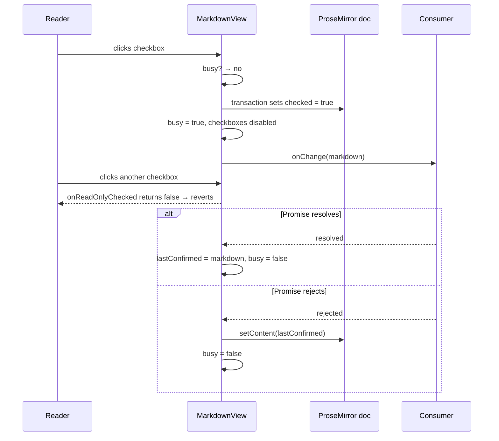

# Design: Markdown view checkboxes

**GitHub Issue:** — (to be created)
**Target release:** 0.12.0 — additive
**Depends on:** `001-markdown-schema-roundtrip`

## Summary

After spec 001, `MarkdownView` renders task lists as real checkboxes — but it runs with `editable: false`, so clicking one does nothing. A checklist a reader cannot tick is a checklist in name only; ticking an item should not require entering edit mode first.

This spec adds an optional `onChange` to `MarkdownView`. When present, a click applies immediately and saving happens in the background. While the consumer's save is in flight, all checkboxes are disabled and further clicks are ignored; if the save fails, the document reverts to the last confirmed state.

## Goals

- A reader can tick and untick items directly in the detail view.
- The click is visible immediately — no waiting for the server.
- A failed save never leaves the UI claiming something was saved.
- Concurrent saves for the same field are impossible by construction.
- `MarkdownView` without `onChange` behaves exactly as it does today.

## Non-goals

- **No progress indicator inside the library.** The consumer owns the Promise and renders its own saving state where it belongs on the page.
- **No per-item pending state.** The busy state is component-wide; see *Component-wide busy state*.
- **No editing beyond checkboxes.** `MarkdownView` stays `editable: false`; text is not editable.
- **No conflict resolution.** If the stored value changed elsewhere while the user was reading, last write wins. Out of scope.

## API design

```ts
export interface MarkdownViewProps {
  readonly content: string;
  /**
   * Called when the reader toggles a task list checkbox, with the complete
   * updated Markdown. Omit to render checkboxes as read-only.
   * Return a Promise to have the view disable interaction until it settles
   * and revert the document if it rejects.
   */
  readonly onChange?: (markdown: string) => void | Promise<void>;
}
```

`onChange` is optional and its return value is optional, giving three levels of engagement:

| Consumer passes | Behaviour |
|-----------------|-----------|
| nothing | Checkboxes render, clicks revert. Unchanged from spec 001. |
| `(md) => void` | Click applies, `onChange` fires, no busy state, no rollback. |
| `(md) => Promise<void>` | Click applies, checkboxes disable until the Promise settles, document reverts on rejection. |

**Why `onChange` and not `onToggleTask`.** A specific callback reporting "item 3 is now checked" would force every consumer to re-derive the Markdown itself, duplicating serialization logic the library already owns and inviting index-drift bugs. Handing over the complete updated Markdown means the consumer's save path is identical to the editor's.

**Why the component keeps its name.** `MarkdownView` remains a read-only rendering of Markdown; a checkbox carries state a reader is allowed to change, which is not the same as editing the document. Renaming would break every existing import for a distinction that does not hold.

## Technical approach

### The read-only click does not touch the document

`TaskItem`'s node view only updates node attributes when the editor is editable (`@tiptap/extension-list/dist/index.js:887-901`). In read-only mode it updates the DOM checkbox and then calls `onReadOnlyChecked(node, checked)` (`index.js:903-907`). The ProseMirror document is left untouched, so serializing right after a click would yield the *old* Markdown.

`MarkdownView` therefore applies the change itself. From inside `onReadOnlyChecked` it resolves the node's position and dispatches a transaction setting `checked`, then serializes:

```ts
TaskItem.configure({
  onReadOnlyChecked: (node, checked) => {
    if (isBusy) return false;              // swallow the click, node view reverts it
    applyChecked(node, checked);           // own transaction
    void save(editor.storage.markdown.getMarkdown());
    return true;
  },
})
```

Returning a falsy value makes the node view revert the checkbox on its own — that is the mechanism used for swallowing clicks while busy, so no separate visual bookkeeping is needed for the rejected click itself.

### Component-wide busy state

Pending state is tracked for the component, not per item. A single `busy` flag drives both the interaction lock and the styling; the `disabled` attribute and a muted colour are applied to every checkbox in the view.

**Rationale.** Per-item tracking would require correlating a toggled item with an incoming `content` prop, surviving reordering and text edits from elsewhere. A component-wide flag needs no correlation, and rollback becomes trivial: the view keeps the last confirmed Markdown and resets to it. Because only one save can be in flight at a time, there is exactly one thing to roll back to.

The lock also removes the race a permissive design would create. Three rapid clicks would otherwise fire three saves for the same field, and if they arrive out of order the wrong one wins. Disabled checkboxes make the unavailability visible rather than silently dropping input.

### Flow



### Guarding the sync effect

`markdown-view.tsx:42-46` calls `editor.commands.setContent(content)` on every `content` change, unguarded — unlike the editor, which compares first. Once ticking feeds Markdown back up to the parent and returns as a new `content` prop, that effect rebuilds the whole document on every click, discarding scroll position and any in-flight state.

The effect gains the same guard the editor uses: compare `content` against the current serialized Markdown and only call `setContent` when they differ. A `content` prop that merely echoes what the view just reported is then a no-op.

If `content` changes to something genuinely different **while a save is pending**, the incoming value wins — it represents the newest known truth — and it also becomes the new `lastConfirmed`, so a subsequent rejection does not roll back to a stale document.

### Styling

Disabled state travels as Tailwind classes on the existing `HTMLAttributes`, consistent with spec 001: the checkbox gets `disabled` set on the input plus muted colouring and `cursor-not-allowed`, so the unavailability is visible and not merely felt.

## Security considerations

`onChange` hands the consumer a full Markdown string derived from the rendered document. It is not user input in the sense of injection — it is a serialization of content the app already stored — but the consumer remains responsible for validating and authorizing the write. `MarkdownView` performs no persistence itself and has no knowledge of permissions; an app that renders a checklist to a user without write access must not pass `onChange`.

## Testing

The interesting behaviour is stateful and lives above ProseMirror, so tests drive a real editor built from `createMarkdownExtensions` and invoke the configured `onReadOnlyChecked` directly, rather than simulating DOM clicks:

- toggling produces Markdown in which exactly one marker changed
- a pending Promise makes the next toggle return `false`
- a rejected Promise restores the previous Markdown
- a `content` change during a pending save is not overwritten by the rollback

## Open questions

- Whether a save that never settles should time out. Currently the view stays disabled indefinitely, which is honest but leaves the UI stuck if the consumer's Promise hangs. Deferred until it happens in practice.
