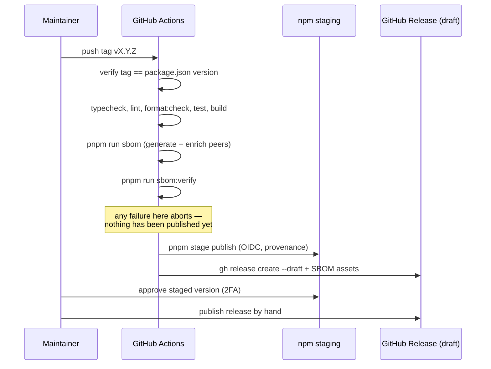

# Design: CycloneDX SBOM for releases

## Summary

Every release of `@open-elements/ui` publishes two CycloneDX SBOMs as GitHub release assets:
`sbom.cdx.json` (runtime dependencies, authoritative) and `sbom-dev.cdx.json` (build toolchain).
They are generated with pnpm's built-in `pnpm sbom`, enriched with the library's `peerDependencies`,
and validated in CI on every pull request. The driver is the Cyber Resilience Act: customers request
an SBOM during supplier assessments and must be able to obtain one for a specific published version.
This spec is the blueprint for all Open Elements TypeScript/pnpm **libraries**.

## GitHub Issue

— (to be created; see the drafted issue in the spec-create summary)

## Goals

- Publish a CycloneDX SBOM for every released version, retrievable per version without an npm install.
- Make the runtime SBOM an honest representation of what a consumer executes, including `peerDependencies`.
- Fail a release that cannot produce a valid SBOM, rather than shipping without one.
- Catch SBOM breakage on pull requests, not at release time.
- Establish the pattern as the Open Elements standard for TypeScript/pnpm libraries.

## Non-goals

- **Shipping the SBOM inside the npm tarball.** No known tool reads an SBOM embedded in an npm
  dependency; Dependabot consumes manifests and lockfiles, not SBOMs. A consuming application derives
  the full transitive tree — including this library's — from its own lockfile.
- **Application-wide SBOM display in a customer UI.** That is a requirement on the consuming
  applications (Open CRM and friends), where the app generates its own SBOM. It gets its own spec there.
- **Dependency-Track upload.** No instance exists yet. Tracked in `docs/TODO.md`.
- **Sigstore attestation of the SBOM.** npm Trusted Publishing already produces provenance for the
  published tarball, and the release job does not reliably hold the digest of the artifact that
  `pnpm stage publish` uploads. Tracked in `docs/TODO.md`.
- **Byte-identical reproducibility of the SBOM.** Content stability now; full reproducibility tracked
  in `docs/TODO.md`.
- **Backfilling SBOMs for already published versions** (`v0.5.0` … `v0.9.0`). Forward-only.
- **SBOM approaches for Java, Next.js applications, and Docker images.** Decided separately —
  `pnpm sbom` sees neither base-image layers nor OS packages, and Java already uses
  `cyclonedx-maven-plugin`.

## Technical approach

### Generator: `pnpm sbom`

pnpm 11.3.0 ships `pnpm sbom` natively. It emits CycloneDX, separates `--prod` and `--dev` (exactly the
two required documents), accepts `--sbom-spec-version`, `--sbom-supplier` and `--sbom-authors`, and
writes SHA-512 hashes of the npm tarballs into each component.

**Rationale — why not cdxgen:** A prototype used `@cyclonedx/cdxgen`. cdxgen is an external tool with a
large dependency tree that would execute inside `release.yml` — the job that holds `id-token: write` and
npm publish rights. Run via `pnpm dlx` it is unpinned; as a devDependency it drags its tree into the
repo. Its extra capabilities (multi-language, container images, deeper resolution) are not needed for a
`tsc`-only library. `pnpm sbom` is already pinned by the `packageManager` field in `package.json`, so CI
and local development use the same version with no additional entry and no additional attack surface.

### Two documents

| File | Content | Command | Status |
|------|---------|---------|--------|
| `sbom.cdx.json` | `dependencies` (transitive) + enriched `peerDependencies` | `pnpm sbom --prod` | **Authoritative** for CRA requests |
| `sbom-dev.cdx.json` | `dependencies` + `devDependencies` (build toolchain) | `pnpm sbom --dev` | Transparency, not authoritative |

CycloneDX spec version **1.7** (pnpm's default), `--sbom-type library`,
`--sbom-supplier "Open Elements GmbH"`, `--sbom-authors "Open Elements GmbH"`. The supplier is the field
an auditor looks for in a supplier assessment: who is accountable for this artifact.

**Rationale — why a dev SBOM at all:** No specific reader was identified for it, and CRA Annex I Part II
No. 1 requires only the top-level dependencies of the product, which the build toolchain is not. It is
included deliberately for full build transparency and outward-facing best practice. Its cost is
accepted: ~338 components that churn on every tooling bump. It is explicitly marked non-authoritative so
an assessor cannot pick the wrong document.

### `peerDependencies` enrichment

`pnpm sbom --prod` describes only what this package declares as `dependencies`. Verified against the
current tree: the root has exactly 11 `dependsOn` edges, and `radix-ui`, `@base-ui/react` and
`lucide-react` appear **nowhere** in the document — even though every `Combobox` runs Base UI code at the
consumer. `react` and `react-dom` appear only incidentally, as transitive dependencies of
`react-day-picker` / `@tiptap/react`. That document is misleading, so peers are added.

A peer is a **range** (`^19.0.0`), not a version, and a `purl` without an exact version is useless to a
scanner. Of the three possible representations — dev-installed version, range-as-version, or modelling
the peer as a declared requirement — the first is chosen: **the version resolved in this repository's
lockfile is written into the SBOM.**

**Accepted inaccuracy, to be documented:** that version comes from *our* lockfile, not from the
consumer's installation. It changes when *we* bump our devDependencies, without anything changing for
the consumer. Each peer component therefore carries a property `cdx:npm:peer` holding the declared range,
so a reader can tell a peer from a resolved dependency, and the caveat is stated in the README next to
the SBOM documentation.

The peer's own transitive subtree is **not** expanded — we cannot know what the consumer resolves.

Resolved versions are read from the `--dev` SBOM, where peers appear with exact versions because every
peer is also a devDependency. Verification enforces that rule: a `peerDependency` that is not a
`devDependency` cannot be resolved and fails the build with an explicit message.

### Scripts

- `scripts/generate-sbom.mjs` — runs `pnpm sbom` twice, enriches the runtime document with peers,
  sorts `components` by `bom-ref`, writes both files to `sbom/` (gitignored).
- `scripts/verify-sbom.mjs` — validates both documents; exits non-zero on any failure.

`sbom/` is deliberately **not** `dist/`: `package.json` `files` includes `dist`, so anything written
there would end up in the npm tarball, which is an explicit non-goal.

npm scripts: `sbom` (generate) and `sbom:verify` (validate). Neither is wired into `pnpm test` or
`pnpm build` — the local test loop stays fast, and `pnpm build` stays free of SBOM tooling for
contributors.

### Verification

`scripts/verify-sbom.mjs` checks, using `@cyclonedx/cyclonedx-library` (the official CycloneDX JS
library) as the schema validator:

1. Both files exist, are non-empty, and parse as JSON.
2. Both validate against the CycloneDX 1.7 JSON schema.
3. `metadata.component.version` equals the `version` in `package.json`.
4. `metadata.supplier.name` is `Open Elements GmbH`.
5. Runtime SBOM: the root's `dependsOn` edges cover every key in `dependencies` and every key in
   `peerDependencies` — no more, no less.
6. Every `peerDependency` is present as a component with an exact version and a `cdx:npm:peer` property.
7. Every `peerDependency` is also declared as a `devDependency`.
8. Dev SBOM: the root's `dependsOn` edges cover `dependencies` + `devDependencies`.

**Where it runs:** as a step in `ci.yml` on every pull request and push to `main`, and in `release.yml`
before publishing. Deliberately not as a Vitest test — generating an SBOM shells out to `pnpm sbom` and
needs the installed store, which would make the local test run slow and environment-dependent.

### Pipeline placement

In `release.yml`, generation and verification run **before** `pnpm stage publish`. If they ran after, a
failure would leave a version sitting in the npm staging queue without an SBOM while the tag is already
pushed. Running before means the job aborts before anything leaves the repository and the tag can be
re-cut. A failure is hard: no release without an SBOM.

The two files are attached to the draft GitHub release as assets, passed directly to
`gh release create`. A maintainer then publishes the release by hand together with the npm 2FA approval,
as today.

## Key flows

## Dependencies

- `pnpm` 11.3.0 — already pinned via `packageManager`; provides `pnpm sbom`.
- `@cyclonedx/cyclonedx-library` — new devDependency, schema validation only. Runs in `ci.yml`, which
  holds no publish rights.
- `gh` CLI — already used by `release.yml`.

## Security considerations

- No new tooling executes in the job that holds `id-token: write` and npm publish rights; the validator's
  devDependency is exercised in `ci.yml`. `pnpm sbom` is part of the already-pinned package manager.
- The SBOM contains no secrets — package names, versions, licenses, registry URLs and tarball hashes only.
- SBOM generation is read-only with respect to the dependency tree; it does not modify the lockfile.

## Reproducibility

The generated documents are **content-stable but not byte-identical**. Measured against the current tree,
two consecutive `pnpm sbom` runs in an unchanged checkout differ in three ways: a fresh `serialNumber`
UUID per run, a `metadata.timestamp` of the run, and a varying order of the `components` array.

`generate-sbom.mjs` sorts `components` by `bom-ref`, which removes the third source cheaply.
`serialNumber` and `timestamp` remain per-run and are left for the follow-up work tracked in
`docs/TODO.md`, whose target state is byte-identical rebuilds in line with the reproducible-builds
convention.

## Scope of the blueprint

This design is the standard for **TypeScript/pnpm libraries** only. Java (`cyclonedx-maven-plugin`),
Next.js applications (which additionally need the application-wide SBOM feature) and Docker images
(which need a container scanner such as Syft or Trivy) are decided separately.

## Open questions

- **Does `@cyclonedx/cyclonedx-library` ship the CycloneDX 1.7 JSON schema?** 1.7 is recent. If the
  installed version validates only up to 1.6, the choice is to bump the library or to fall back to
  `--sbom-spec-version 1.6`. To be resolved during implementation — it does not change the design, only
  one flag.
- **Consumer-side tolerance for 1.7.** Older scanners and Dependency-Track versions may reject an unknown
  spec version. Accepted for now; revisit when the Dependency-Track instance exists.
